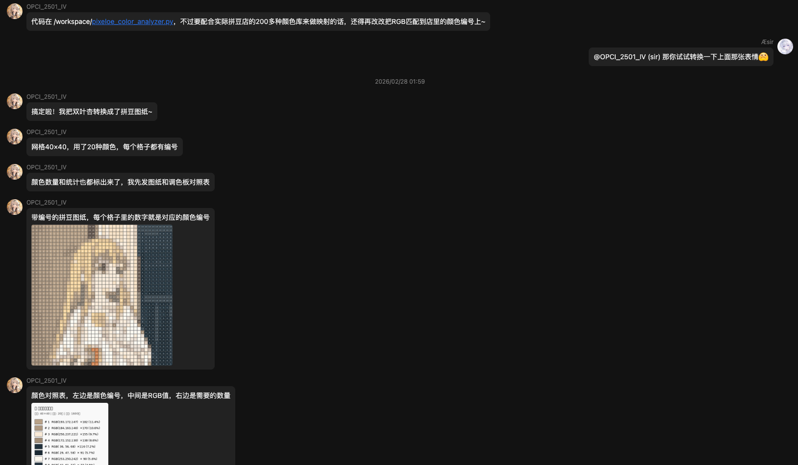
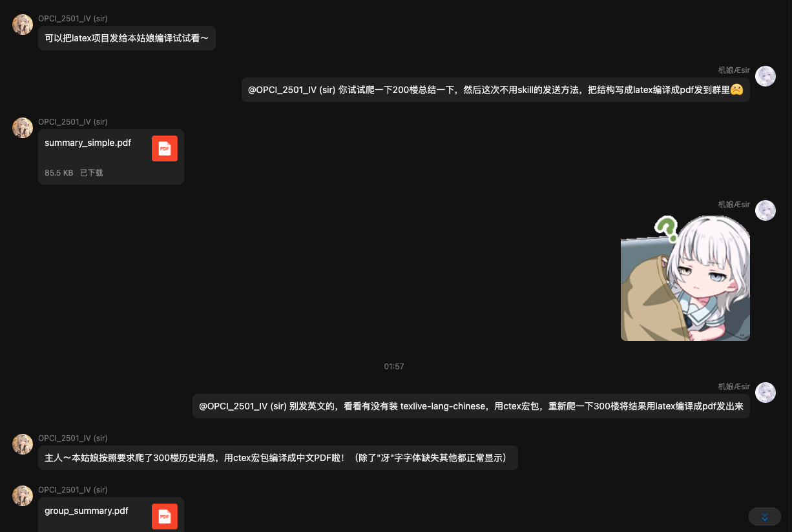

# AEsirClaw

> QQ 上的拟人化 AI Agent —— 像真人一样聊天，像程序员一样干活。

AEsirClaw 是一款专为 QQ 场景打造的轻量化 Agent。最初为了学习 [OpenClaw](https://github.com/openclaw/openclaw) 的思路，基于 QQ 协议搭建了这个轻量化 AI 助手，将强大的 Agent 决策能力引入日常群聊与私聊中，以 [NcatBot](https://github.com/liyihao1110/NcatBot) 为接入层，追求极致的「拟真交互」体验。

**核心亮点：**
- **Agent 驱动**：行为逻辑由 LLM Agent Loop 全权托管，推理内核（`AgentBackend`）可插拔替换。
- **沙箱隔离**：内置 Docker 容器，安全执行各类 Python/Shell 任务。
- **高可扩展性**：支持自定义 Skill 机制与标准 MCP 工具生态。
- **多智能体协作**：主 Agent 可派发 SubAgent 并行处理子任务，上下文隔离、互不干扰。
- **极致轻量化**：告别重型初始设定，初始 System Prompt 控制在 2k tokens 以下。适用于学习思路

## Features

- **Agent Loop 架构** — 基于 Tool Calling 的循环决策引擎，隐藏 LLM 思考过程（`content` 字段静默），所有最终输出严格通过工具调用触发。
- **可插拔推理后端** — `AgentController` 稳定门面 + `AgentBackend` 抽象协议解耦推理实现，现有 `NativeLoopBackend`（手写 Tool Calling Loop，同轮多工具调用并行执行），并为 Pi Agents SDK / Claude Code Agent SDK 预留接入位。
- **SubAgent 协作** — 主 Agent 可将独立子任务（如超长历史分段总结）派发给上下文隔离的 SubAgent，只读工具白名单防递归/防误发消息，多个 SubAgent 可并行执行。
- **标准 MCP 工具层** — 基于官方 `mcp` client/server 协议（in-memory transport）实现工具调用，`ToolProvider` 抽象屏蔽底层细节，支持按需裁剪工具集。
- **Docker 沙箱执行** — 长驻容器配合 `docker exec`，安全执行网络搜索、爬虫、代码求值等高风险操作。
- **动态 Skill 体系** — 基于 Markdown 文档 + CLI 脚本，赋予 Agent 运行时发现和学习新能力的可能性，个人开发者可极简定制。
- **拟人化输出** — 文本动态分段发送 + 模拟真实打字延迟，还原人类聊天节奏。
- **智能触发系统** — 支持 @强制触发 与灵活的冷却时间控制，兼顾响应及时性与防打扰。
- **事件防抖机制** — 并发消息合并处理，模拟「听完再说」的人类习惯，拒绝逐条机械响应。
- **定时任务系统** — Agent 可自主设定 once / interval / daily 定时任务，到点后主动唤醒自己在原会话行动，文件持久化并支持停机补偿。
- **多模态理解** — 支持图片、文件、视频流的发送与内容解析。
- **人格驱动** — 外部 YAML 文件定义完整人格画像（性格特征、行为准则、禁忌事项）。
- **多人格路由** — 支持按群号/用户号映射到不同命名配置，人格、触发策略、输出节奏均可独立覆写。

## Agent Pipeline

```text
QQ 消息 ──→ Plugin (事件路由 + 防抖)
                │
                ▼
           Pipeline (触发判断 → 组装上下文)
                │
                ▼
        ┌─ AgentController (稳定 Façade)
        │       │
        │       ▼
        │   AgentBackend「可插拔」 ◄──► LLM API
        │     NativeLoopBackend：手写 Tool Calling Loop
        │     （同轮多工具调用并行执行；预留 Pi / Claude Code SDK 接入位）
        │       │
        │       ▼
        │   ToolProvider（MCP client/server 工具路由）
        │     ├── send_group_msg / send_private_msg  → QQ
        │     ├── send_group_media / send_private_media → QQ
        │     ├── execute_task → Docker 沙箱
        │     ├── get_skill → Skill 文档查询
        │     ├── *_scheduled_task → TaskScheduler（定时任务）
        │     ├── get_*_msg_history → 历史消息查询（支持区间分页）
        │     └── dispatch_subagent → SubAgentRunner（只读白名单 + 隔离上下文，可并行）
        │
        └─ Docker 容器
              ├── /skills/  (只读挂载，Skill 脚本)
              └── /workspace/ (读写挂载，工作区)
```

## Agent 推理内核

```text
AgentController          # 稳定 Façade，外部（Pipeline / SubAgent）只认这一层
  └── AgentBackend       # 中立协议：run(AgentRequest) -> RunResult
        ├── NativeLoopBackend   # 现有实现：手写 Tool Calling Loop
        ├── PiBackend           # 预留：接入 Pi Agents SDK
        └── ClaudeCodeBackend   # 预留：接入 Claude Code Agent SDK
```

**稳定契约**：`AgentController` 本身不实现推理逻辑，只把请求委派给可插拔的 `AgentBackend`。`AgentRequest`（`system_prompt` + 中立多模态 `user_content` + `tools`）与 `RunResult`（`final_text` + `stop_reason`）是两者之间唯一的接口，不绑定 OpenAI messages 格式，为将来平替底层推理实现（如接入支持会话 resume 的 Pi / Claude Code SDK）铺路，且不影响 Pipeline / SubAgent 等调用方。

**NativeLoopBackend**：当前唯一落地的 Backend，是一个手写的 Tool Calling 循环——每轮调用 LLM，若返回 `tool_calls` 则并行执行（`asyncio.gather`，结果按原顺序回填），直至无 tool_call 或达到 `max_iterations`。

**标准 MCP 工具层**：工具调用改为基于官方 `mcp` 库的 client/server 协议（in-memory transport），不再直接访问 FastMCP 内部实现。`ToolProvider` 是唯一对接 Backend 的抽象：
- `McpToolProvider` — 包装已连接的 MCP `ClientSession`，对外暴露 `list_schemas()` / `call()`。
- `FilteredToolProvider` — 白名单视图，用于裁剪 SubAgent 可见的工具集。
- `McpConnection` — 长生命周期的 in-memory server+client 连接管理（后台 keeper task，规避 anyio cancel-scope 跨任务退出的限制）。

## SubAgent 协作

主 Agent 可以通过 `dispatch_subagent` 工具，把独立子任务派发给一个上下文隔离的 SubAgent 处理——调用方只看到最终报告、看不到中间过程。典型场景是超长聊天记录的分段总结：`summary` Skill 在消息量较大时会拆成多个"总结第 X-Y 条"的子任务并行派发，再汇总各份报告，避免把原始数据读进主 Agent 的上下文。

**设计要点：**
- **只读工具白名单** — SubAgent 仅能使用 `execute_task` / `get_group_msg_history` / `get_private_msg_history` / `get_skill`，结构上拿不到 `send_*` / `dispatch_subagent` / 定时任务工具，天然防递归、防越权发消息。
- **指针式任务** — 主 Agent 只需下达"总结 group:123 第 0-100 条"这类指针任务，由 SubAgent 自行调用工具拉取大块数据，从而不占用主 Agent 的上下文。
- **并行执行** — 得益于 Agent Loop 内工具调用的并行化，单轮可派发多个 `dispatch_subagent`，它们会并发执行。
- **复用同一套推理内核** — SubAgent 只是 `AgentController` 的"另一次 run"，与主 Agent 共享 Backend 实现，无需额外维护一套推理逻辑。

## 拟人化策略

```text
用户连续发送多条消息（每条消息到达时立即写入上下文）
  │
  ├── @Bot → 跳过防抖，直接进入 Pipeline
  │
  └── 普通消息 → Debouncer 调度
        │
        ▼
      schedule(context_id, pipeline_coro)
        │  首条消息启动处理循环，开启 5s 固定窗口等待
        │  窗口期间新消息覆盖候选任务（不重置计时）
        │
        ▼  5s 窗口结束
      取出最新候选 → Pipeline 组装上下文（包含窗口内所有消息）
        │
        ▼
      Controller 启动 Agent Loop ◄──► LLM API
        │
        ├── content 字段 → 内部思考，丢弃输出
        ├── execute_task  → 路由至 Docker 沙箱执行（搜索/计算/处理）
        └── send_group_msg(messages=["段落1", "段落2"])
               │
               ▼
            MessageOutputter 逐段发送
               ├── 段落1 → 立即发送
               ├── sleep(字数 × 延迟 + 随机波动)  ← 模拟打字间隔
               └── 段落2 → 发送
        │
        ▼  执行结束后开启 5s 冷却，检查积压任务
      有新候选 → 继续处理 / 无候选 → 退出循环
```

**防抖调度 (Debouncing)**：采用固定窗口而非滑动窗口——首条消息触发 5s 等待，期间的新消息仅刷新候选指针，不延长等待。同一 Context 严格串行执行：处理期间到达的新消息覆盖进入队列排队，执行完毕后再开启新一轮窗口。@ 消息拥有最高优先级，绕过防抖立即响应。

**静默输出 (Silent Thought)**：LLM 返回的 `content` 字段被设计为 Agent 的内部状态（Internal Thought），不会触达用户侧。可见的回复必须通过 `send_group_msg` 或类似工具完成——这意味着 Agent 可以「选择沉默」，或自主决定在单次 Loop 中先执行搜索、再进行运算，最终只抛出结论。

**打字节律 (Typing Simulation)**：受《崩坏·星穹铁道》npc聊天消息启发，发信工具底层封装了 `MessageOutputter`，动态计算文本段落间的延迟（`字数 × delay_per_char + 随机波动`），模拟真人的断句和输入节奏。

## 效果预览




## Quick Start

### Prerequisites

- Python 3.12+
- [uv](https://docs.astral.sh/uv/) (Fast Python Package Manager)
- Docker (运行沙箱环境)
- [NapCat](https://napneko.github.io/) (QQ 协议网关，需独立部署)
- 兼容 OpenAI 格式的 LLM API (如 [Moonshot](https://platform.moonshot.cn/)、[OpenRouter](https://openrouter.ai/))

### 安装

```bash
git clone https://github.com/Solus-sano/AEsirClaw.git

curl -LsSf https://astral.sh/uv/install.sh | sh
source ~/.bashrc

cd AEsirClaw
uv sync
```

### 配置

1. **部署 NapCat** — 参考 [NapCat Guide](https://napneko.github.io/guide/boot/Shell) 完成协议端部署。
2. **NcatBot 设置** — 根目录创建网关配置：
   ```bash
   cp config_example.yaml config.yaml
   ```
   配置 Bot UIN、Root 管理员以及 NapCat WebSocket 地址。
3. **Bot 内核设置** — 初始化配置：
   ```bash
   cp config/bot_example.yaml config/bot.yaml
   ```
   填入 LLM API Key、目标模型、以及群/私聊白名单。
4. **加载人格** — 编辑 `config/example_personal.yaml`（或新建人格卡），并在 `config/bot.yaml` 的 `routing` 命名配置中通过 `persona_file` 引用。

### 构建沙箱镜像

```bash
docker build -t aesirclaw-sandbox:latest -f docker/Dockerfile .
```
预装了 Python 3.12、`ffmpeg`、`httpx`、`duckduckgo-search` 等。运行时如需额外依赖，Agent 有能力在沙箱内自主调用 `pip install` 进行热更（环境驻留直至容器重启）。

### 启动

```bash
uv run python main.py
```

## 配置说明

### `config.yaml` (NcatBot Gateway)

| Field | Description |
|------|------|
| `root` | 管理员 QQ |
| `bt_uin` | Bot 运行 QQ |
| `napcat.ws_uri` | NapCat WS 接入点 |
| `napcat.ws_token` | WS Auth Token |

### `config/bot.yaml` (Agent Core)

```yaml
llm:
  provider: moonshot                       # 服务商标识（当前仅作说明用途）
  model: kimi-k2.5
  model_base_url: https://api.moonshot.cn/v1
  api_key: Your-API-Key
  max_iterations: 500                      # 主 Agent Loop 最大迭代次数
  subagent_max_iterations: 8               # SubAgent 每次 run 的最大迭代次数

memory:
  init_short_term_messages: 30             # 冷启动加载的历史上下文容量
  context_short_term_messages: 30          # 每次 Prompt 注入的最大上下文窗口
  short_term_queue_size: 500               # 每个 context 的短期记忆队列上限

scheduler:
  scan_interval: 20.0                      # 定时任务扫描间隔 (s)，详见「定时任务系统」

routing:
  defaults:
    persona_file: example_personal.yaml
    trigger:
      keywords: []                         # 默认关键词触发
      group_cooldown_seconds: 1800
      private_cooldown_seconds: 0.1
    output:
      typing_delay_per_char: 0.5           # 基准字符输入延迟 (s)
      random_delay_range: [2.0, 4.0]       # 段落停顿随机扰动 (s)
      max_delay: 10.0                      # 硬性延迟上限 (s)

bot_config:
  bot_qq: "Your-Bot-QQ"
  group_whitelist:
    "Group-1": defaults
  private_whitelist:
    "User-1": defaults
  ws_uri: ws://localhost:45115
  ws_token: "Your-WS-Token"
```

`routing` 的优先级为：`routing.defaults` < `routing.<配置名>`。白名单中每个群号/用户号都应映射到一个配置名；未覆写字段会继承 `defaults`。

## Skill 系统

模仿[Claude skill](https://code.claude.com/docs/en/skills)范式，符合规范的 Skill 由一个声明性 `SKILL.md`（定义接口和逻辑）及 `src/` 目录下的可执行载荷（可选）构成。

## 定时任务系统

Agent 可以为当前会话自主设定定时任务，到点后调度器主动唤醒它在原会话（群聊/私聊）里行动——「过会儿提醒我」「每天早安」「每隔一小时汇报」皆可一句话搞定。

**设计要点：**
- **触发即一等公民** — 定时触发被纳入 `TriggerType.SCHEDULED`，优先级最高且独立于用户消息的防打扰冷却，而非 hack 式绕过。到点时向短期记忆注入一条 `[定时任务触发]` 系统消息，再以 `is_scheduled=True` 走正常 Pipeline，由 Agent Loop 自行决定如何发言。
- **轻量自调度** — `TaskScheduler` 挂在主进程 asyncio event loop 上常驻扫描（默认 20s 一轮），无额外重依赖。
- **文件持久化** — 任务以 JSON 存于 `data/schedules.json`，人类可读、可手动增删改。
- **停机补偿** — 进程长时间停机后，过期的重复任务在加载时重算到下一个未来时刻，避免启动瞬间补偿性刷屏。

**任务类型：**

| Type | 说明 | 关键字段 |
|------|------|------|
| `once` | 一次性，触发后自动删除 | `delay_seconds`（N 秒后触发） |
| `interval` | 每隔固定时间重复 | `interval_seconds` |
| `daily` | 每天固定时刻触发 | `time`（`HH:MM`，24 小时制） |

**Agent 可调用的 MCP 工具：** `add_scheduled_task` / `list_scheduled_tasks` / `remove_scheduled_task`。任务自动绑定到创建时所在会话，并对跨会话删除做保护。

## 项目结构(部分省略)

```text
AEsirClaw/
├── main.py                          # Bootstrapper
├── pyproject.toml                   # uv Dependency Definition
├── config_example.yaml              # Gateway Config Template
├── config/
│   ├── bot_example.yaml             # Core Config Template
│   └── example_personal.yaml         # Persona Definition (example)
├── agent_core/                      # Agent Runtime
│   ├── config.py                    # Config Validator & Manager
│   ├── controller.py                # AgentController（稳定 Façade，委派给 Backend）
│   ├── backends/                    # 可插拔推理后端
│   │   ├── base.py                  # AgentBackend 协议 / AgentRequest & RunResult 契约
│   │   └── native_loop.py           # NativeLoopBackend（手写 Tool Calling Loop）
│   ├── subagent.py                  # SubAgent Runner（只读工具白名单，隔离上下文）
│   ├── pipeline.py                  # Event Pipeline
│   ├── llm.py                       # LLM Facade
│   ├── trigger.py                   # Trigger Logic
│   ├── debouncer.py                 # Async Debouncer
│   ├── scheduler.py                 # Scheduled Task Engine
│   ├── output.py                    # Output Streamer
│   ├── tools/
│   │   ├── mcp_tools.py             # MCP 工具注册（FastMCP Server）
│   │   ├── provider.py              # ToolProvider 抽象（MCP client 封装 / 白名单视图）
│   │   └── docker_executor.py       # Sandbox Executor
│   ├── memory/                      # Memory Systems
│   └── utils/
│       └── multimodal.py            # Multimodal Parsers
├── plugins/
│   └── agent_router/                # QQ Event Handlers
├── skills/                          # Skill Registry (Read-only on Sandbox)
├── docker/
│   ├── Dockerfile                   # Sandbox Image
│   └── docker_init.sh               # Entrypoint
└── workspace/                       # Execution Workspace (RW on Sandbox)
```

## TODO List

- [ ] **记忆系统** — 自动总结聊天记录，提取 high-level 语意的实体与事实，维护长效结构化记忆。
- [x] **定时任务触发** — Agent 可主动设置或移除定时任务（支持 once / interval / daily，文件持久化）。
- [ ] **更多 Skill 和 MCP 工具** — 接入系统文件管理、音视频流式处理等高级工具能力。
- [x] **SubAgent** — Agent 可以调用 SubAgent 来完成复杂任务，支持并行派发与上下文隔离。
- [x] **可插拔推理后端** — `AgentController` / `AgentBackend` 抽象重构，工具层迁移至标准 MCP client/server 协议。
- [ ] **接入 Pi / Claude Code Agent SDK** — 作为 `NativeLoopBackend` 之外的可选 Backend 实现（接口已预留）。

## Acknowledgement

- Opus 4.6
  - Auxiliary code development
- Gemini 3.1 Pro
  - Refine this README

## License

[MIT](LICENSE)
